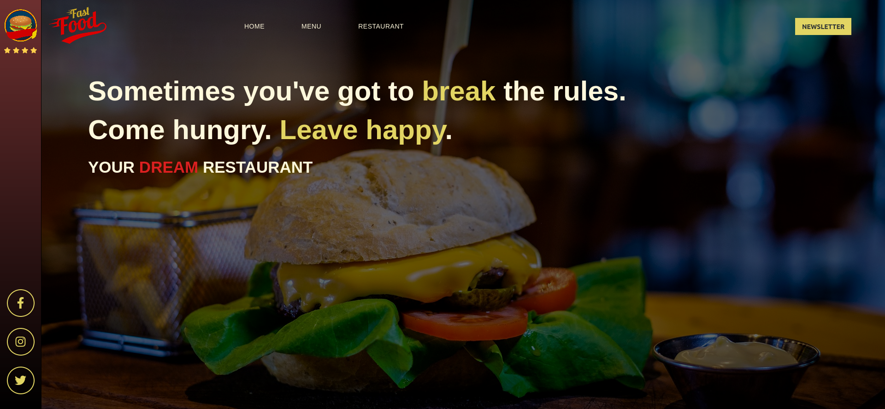

# food-website
DEMO: https://michakow.github.io/food-website/

## General info
Website created to practice CSS skills, presents a restaurant serving fast food.
Inspired by KFC and Burger King websites.  

## Technologies used in project 
- HTML
- CSS (BEM naming convention, Flexbox, RWD)
- JavaScript
